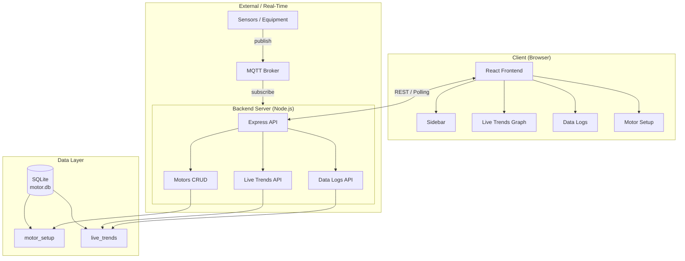
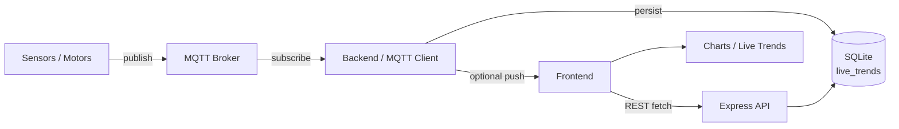
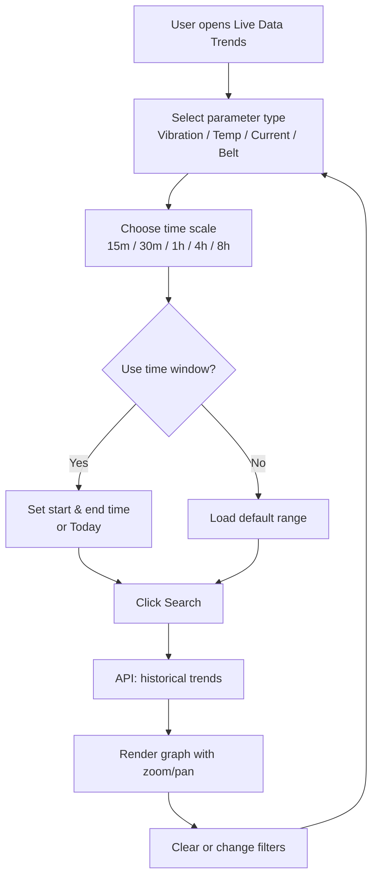
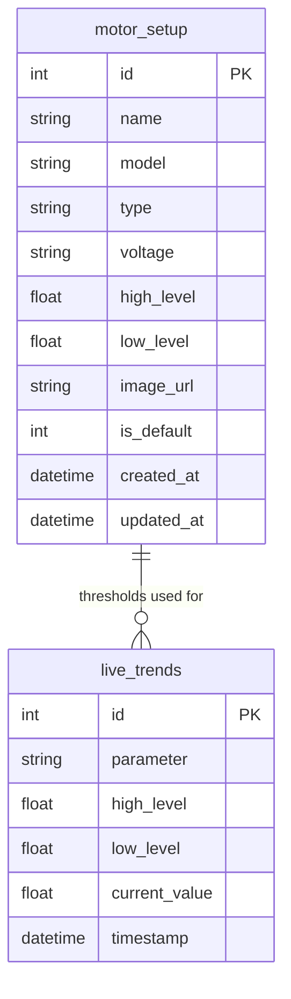

# Servo Motor Health Parameters Dashboard — Project Report

**Document Version:** 1.0  
**Date:** February 14, 2026  
**Project:** Servo Motor Health Parameters Dashboard

---

## 1. Executive Summary

The **Servo Motor Health Parameters Dashboard** is a full-stack web application for monitoring and visualizing servo motor health metrics in real time. It provides motor setup management, live parameter trends (vibration, temperature, power consumption, belt tension, speed, torque), and historical data logs with status highlighting. **Real-time data is displayed using MQTT** (Message Queuing Telemetry Transport), enabling live updates from sensors and equipment to the dashboard. The system uses a React frontend, Node.js/Express backend, and SQLite database, with a modern UI including a 3D background and collapsible sidebar.

---

## 2. Technology Stack

### 2.1 Frontend

| Technology | Version / Purpose |
|------------|-------------------|
| **React** | 18.2.0 – UI framework |
| **Vite** | 7.x – Build tool and dev server |
| **Chart.js** | 4.5.x – Charts and graphs |
| **react-chartjs-2** | 5.3.x – React bindings for Chart.js |
| **chartjs-plugin-zoom** | 2.2.x – Zoom and pan on charts |
| **Three.js** | 0.182.x – 3D background (Hero3D) |
| **@react-three/fiber** | 8.15.x – React renderer for Three.js |
| **@react-three/drei** | 9.122.x – Three.js helpers |
| **react-icons** | 4.12.x – Icon set (e.g. Font Awesome) |
| **Lucide React** | 0.563.x – Additional icons |

### 2.2 Backend

| Technology | Version / Purpose |
|------------|-------------------|
| **Node.js** | Runtime |
| **Express** | 4.21.x – HTTP API server |
| **better-sqlite3** | 11.7.x – SQLite database driver |
| **cors** | 2.8.x – Cross-origin resource sharing |

### 2.3 Database

| Component | Description |
|-----------|-------------|
| **SQLite** | File-based database (`motor.db`) |
| **Tables** | `motor_setup`, `live_trends` (with indexes on parameter and timestamp) |

### 2.4 Development & Tooling

| Tool | Purpose |
|------|---------|
| **concurrently** | Run frontend and backend in one command (`npm run dev:full`) |

---

## 3. Real-Time Data: MQTT

**MQTT is used for displaying real-time data** on the dashboard. Sensor and motor data are published to an MQTT broker; the backend or a dedicated service can subscribe to these topics and persist or forward the data. The dashboard then shows live parameter values (vibration, temperature, power consumption, belt tension, speed, torque) and updates the Live Trends graphs as new MQTT messages arrive. This design ensures low-latency, scalable real-time monitoring suitable for industrial environments.

*Note: The current UI may use REST APIs and polling until the MQTT client is fully wired end-to-end; the architecture is intended to be backed by MQTT for real-time data display.*

---

## 4. Features of the Dashboard

### 4.1 Navigation & Layout

- **Collapsible sidebar** – Transparent sidebar that collapses to icons only for more screen space.
- **3D background (Hero3D)** – Three.js-based background for a modern look.
- **Live status indicator** – Top-right indicator showing connection/live state.

### 4.2 Motor Setup

- **Motor model dropdown** – HK, HG, HF, HF-KP, LM-F, TM-RB series.
- **Motor name and rating** – Name and rating (e.g. High Level / Low Level).
- **Model-based images** – Each motor model has an associated image from assets (no file upload).
- **CRUD operations** – Create, read, update, and delete motor configurations via REST API; data stored in SQLite `motor_setup` table.
- **Motor context** – Selected motor can be used across the app (e.g. for trends and thresholds).

### 4.3 Live Data Trends

- **Parameter types** – Vibration, Temperature, Power Consumption, Belt Tension, Speed, Torque (each with its own graph view).
- **Time scaling** – 15 min, 30 min, 1 hr, 4 hr, 8 hr for historical range.
- **Time window filter** – Start and end date/time (and “Today”) to limit the data range.
- **Search and Clear** – Magnifying glass to apply filters, cross icon to clear.
- **Zoom and pan** – Chart.js zoom plugin for interactive exploration of time-series data.
- **Graph-only view** – No data table on the Live Trends page; focus on visualization.

### 4.4 Data Logs

- **Tabular view** – Historical data in a table with solid borders and center-aligned values.
- **Parameter filter** – Filter by parameter type.
- **Date and time pickers** – Filter by date and time range.
- **Search** – Apply filters and refresh results.
- **Status column** – Critical / Warning / Normal.
- **Highlighting** – Only values at or above high (e.g. dark red) or in warning range (e.g. orange) are highlighted; normal values remain unhighlighted but status is still shown.

### 4.5 Other Pages

- **Home** – Overview and quick stats.
- **Motor Health** – Detailed health metrics.
- **Alarms** – Real-time alarm monitoring.
- **Maintenance** – Maintenance schedule and tasks.
- **Settings** – Configuration options.

---

## 5. System Architecture

The following diagram shows the high-level components and how they interact.



---

## 6. Data Flow (Real-Time Path)

This flowchart illustrates how real-time data moves from sensors to the dashboard, with MQTT as the transport.



---

## 7. User Flow: Live Trends

Typical user flow when viewing and filtering live trends.



---

## 8. Database Schema

### 8.1 Tables Overview



### 8.2 Table Descriptions

- **motor_setup** – Stores motor configurations: name, model, type, voltage, high/low levels, image URL, default flag, and timestamps.
- **live_trends** – Stores time-series health data: parameter name, high/low levels, current value, and timestamp. Indexed on `(parameter, timestamp)` for fast historical queries.

---

## 9. API Overview

| Method | Endpoint | Description |
|--------|----------|-------------|
| GET | `/api/motors` | List all motors |
| GET | `/api/motors/:id` | Get one motor |
| POST | `/api/motors` | Create motor |
| PUT | `/api/motors/:id` | Update motor |
| DELETE | `/api/motors/:id` | Delete motor (non-default only) |
| POST | `/api/live-trends` | Save one live trend sample |
| GET | `/api/live-trends` | Get live trends (optional `parameter`, `limit`) |
| GET | `/api/live-trends/latest` | Latest value per parameter |
| GET | `/api/live-trends/historical` | Historical trends by `minutesAgo`, optional `parameter`, `afterTimestamp` |
| DELETE | `/api/live-trends` | Delete trends for a parameter (query: `parameter`) |

---

## 10. Project Structure (Key Paths)

```
Servo-motor-health-parameters-Dashboard/
├── frontend/
│   ├── src/
│   │   ├── components/
│   │   │   ├── Sidebar.jsx
│   │   │   ├── LiveTrendsGraph.jsx   # Live trends + time window + zoom/pan
│   │   │   └── LiveStatusIndicator.jsx
│   │   ├── pages/
│   │   │   ├── Home.jsx
│   │   │   ├── MotorSetup.jsx        # Motor form, model-based images
│   │   │   ├── DataLogs.jsx          # Table, filters, status highlighting
│   │   │   ├── LiveDataTrends.jsx
│   │   │   └── ...
│   │   ├── services/
│   │   │   ├── liveTrendsApi.js
│   │   │   └── motorApi.js
│   │   ├── App.jsx
│   │   └── Hero3D.jsx                # 3D background
│   └── package.json
├── backend/
│   ├── index.js                      # Express API + SQLite
│   └── motor.db                      # SQLite database
├── package.json                      # Root scripts (dev:full, install:all)
└── PROJECT_REPORT.md                 # This report
```

---

## 11. Conclusion

The Servo Motor Health Parameters Dashboard delivers a complete solution for monitoring servo motor health: motor setup management, **real-time data display via MQTT**, live trend visualization with time scaling and zoom/pan, and data logs with status highlighting. The tech stack (React, Vite, Chart.js, Three.js, Node.js, Express, SQLite) supports a modern, responsive UI and scalable backend. The diagrams and flowcharts in this report describe the system architecture, real-time data flow, and user flows for key features.

---

*End of Report*
